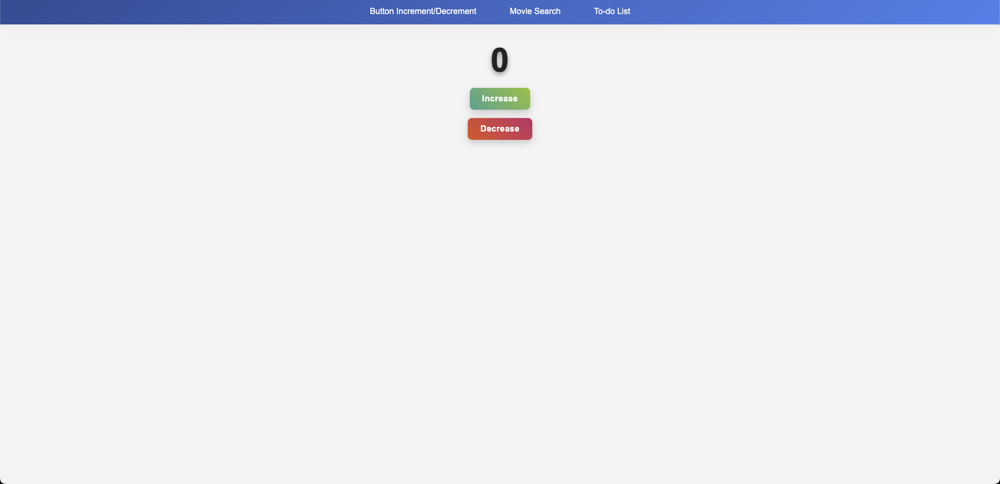
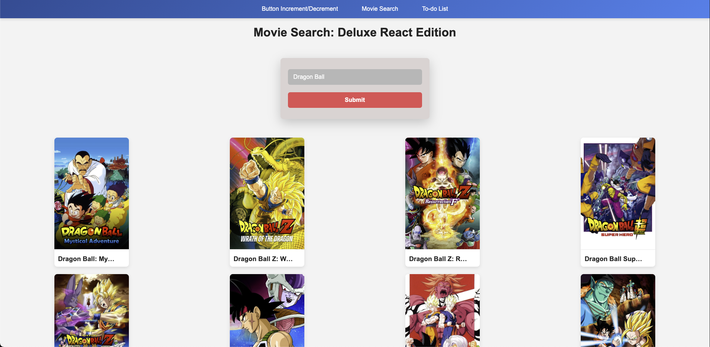
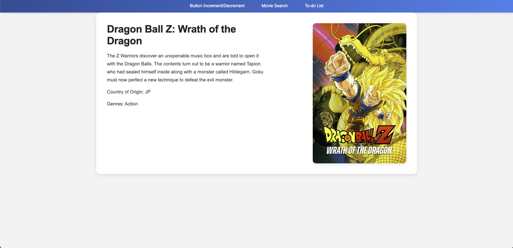
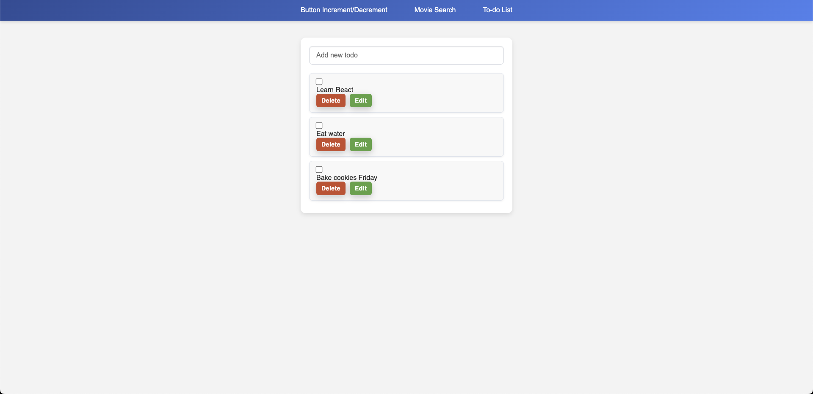

This is my React Week 2 Challenges Project! This application features awesome button incrementer/decrementer, a movie search 
as well as a To Do list for all your daily needs!

Here is a hosted link for the app [Here](https://reactweek2-ac4e4e231efe.herokuapp.com/)

Instructions on how to use the Button Incrementer: 
Use the Increment button to add 1 
Use the Decrementer button to descrease the amount by one

Instructions on how to use the movie search: 
In the search bar, type a movie that you would like to search for. It will display movies based on what you search for.

Hover over the movie, and it will prompt you to click the movie of your choice. It will take you to a page with movie details!

Instructions on how to use the To-do List:
Use the input to add a task. IE: Learn React at 2pm, Eat water, Bake cookies Friday. 
Press your enter key and it will add it to your screen. 
You can edit your tasks by pressing the edit button. Save will allow you to save your changes. 
The delete button will remove the tasks from your list. 
